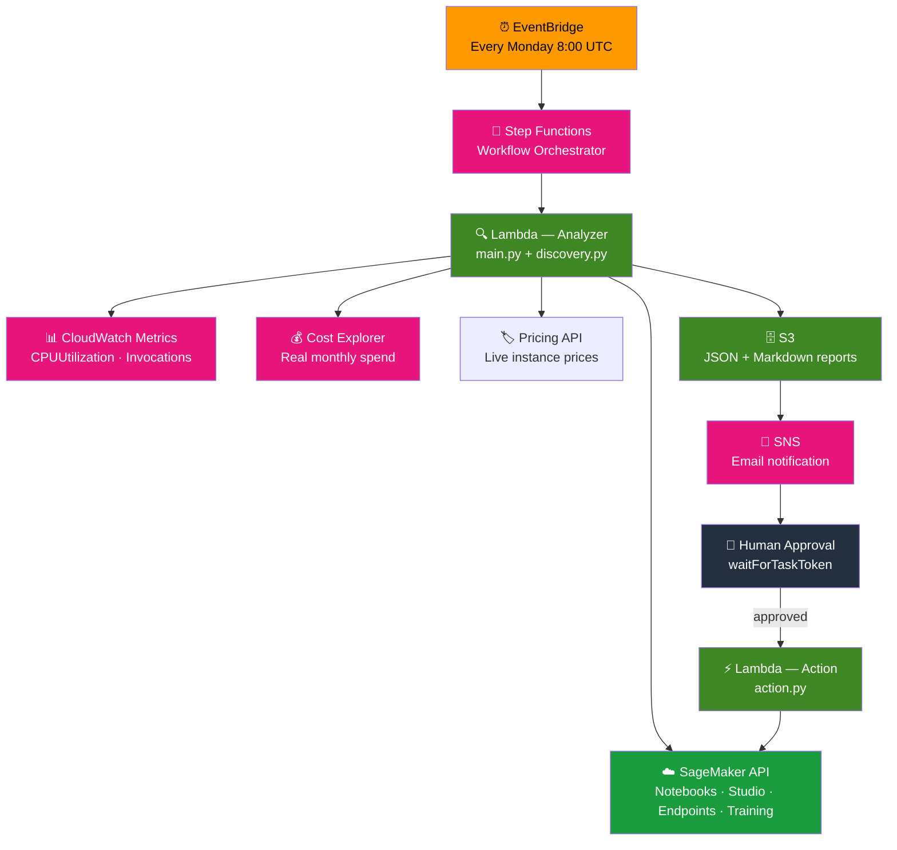

[](https://github.com/mboumhawahaga-ship-it/aws-machine-learning-cost-optimizer/actions/workflows/ci.yml)
[](https://github.com/mboumhawahaga-ship-it/aws-machine-learning-cost-optimizer)
[](LICENSE)
[](https://www.python.org)
[](https://www.terraform.io)

# AWS ML Cost Optimizer

> Automatically scan your SageMaker environment every week, identify what is being wasted, and receive a prioritized report by email — with GDPR and EU AI Act compliance checks built in.

---

## The Problem

SageMaker costs spiral silently:

- Notebooks run 24/7 even when nobody is using them
- Training jobs run at full On-Demand price when Spot instances cost 70% less
- Inference endpoints stay alive with no traffic
- Nobody gets an alert until the monthly AWS invoice arrives

---

## What It Does

Every Monday at 8:00 AM, the tool:

1. **Scans** all SageMaker resources — notebooks, Studio apps, endpoints, training jobs
2. **Calculates** real costs using live AWS Pricing API data
3. **Checks** GDPR tag compliance and EU AI Act requirements on each resource
4. **Sends** a prioritized report by email with exact dollar savings
5. **Waits** for your approval before taking any action

Nothing is changed automatically. You decide what to act on.

```
EventBridge (every Monday 8:00 UTC)
        ↓
Scan SageMaker resources + fetch real costs
        ↓
Generate report → Save to S3 → Send email
        ↓
Wait for human approval (waitForTaskToken)
        ↓
Execute approved action (stop notebook / delete endpoint)
```

---

## Real Numbers

Prices pulled live from the AWS Pricing API.

| What's being wasted | Typical monthly cost | Savings available | Effort |
|---|---|---|---|
| Notebooks left running | $70–$212 / notebook | **75%** with auto-stop | Low |
| Training on On-Demand | $100–$500 / job | **70%** with Spot instances | Medium |
| Idle inference endpoints | $50–$170 / endpoint | **30%** with auto-scaling | Medium |
| Old data in S3 Standard | $23 / TB | **83%** moved to Glacier | Low |

**Example — team spending $850/month:**

| Period | Spend | Change |
|---|---|---|
| Before | $850 | baseline |
| Month 1 (quick wins) | $620 | −27% |
| Month 2 (full optimization) | $480 | −44% |
| **Annual savings** | **$4,440** | |

---

## Sample Report

```
# ML Cost Analysis Report
Generated: 2026-04-09

## Executive Summary
| Metric              | Value     |
|---------------------|-----------|
| Total Monthly Spend | $850.00   |
| Identified Savings  | $449.78   |
| Savings Potential   | 52.9%     |
| Recommendations     | 4 items   |

## Optimization Recommendations
| Category  | Issue                          | Savings  | Effort | Priority |
|-----------|--------------------------------|----------|--------|----------|
| Training  | Use Spot instances (70% off)   | $207.90  | Medium | Critical |
| Notebooks | Enable auto-stop (idle 24h)    | $159.00  | Low    | High     |
| Endpoints | Add auto-scaling               | $51.00   | Medium | High     |
| Storage   | Move old data to Glacier       | $31.88   | Low    | Medium   |

## GDPR Compliance
Global Risk: ⚠️ Medium
| Resource    | Risk   | Alert                              |
|-------------|--------|------------------------------------|
| my-notebook | Medium | Tag 'expiration-date' manquant     |

## EU AI Act Compliance
Global Status: ⚠️ Incomplete
| Endpoint      | Risk  | Human Oversight | Alert                        |
|---------------|-------|-----------------|------------------------------|
| my-endpoint   | high  | not-set         | [Art. 14] human-oversight manquant |
```

Full example: [docs/samples/report-example.md](docs/samples/report-example.md)

---

## Compliance Features

### GDPR
Checks mandatory tags on every SageMaker resource:
- `owner` — who is responsible
- `data-classification` — sensitivity level
- `expiration-date` — data retention period

### EU AI Act
Checks endpoints serving ML models in production:
- `ai-risk-level` — classification required (Art. 9)
- `human-oversight: enabled` — mandatory for high-risk systems (Art. 14)
- `model-purpose` — use case documentation (Art. 13)
- `conformity-assessment` — required for high-risk models (Art. 9)

> Penalties for non-compliant high-risk AI systems: up to €35M or 7% of global annual turnover.

---

## Setup

### One-command install

```bash
git clone https://github.com/mboumhawahaga-ship-it/aws-machine-learning-cost-optimizer
cd aws-machine-learning-cost-optimizer
bash setup.sh
```

The script will:
1. Check AWS CLI, Terraform, Python are installed
2. Ask for your email address
3. Create the S3 bucket + DynamoDB table for Terraform state
4. Build the Lambda package
5. Deploy everything with `terraform apply`
6. Tell you to confirm the subscription email from AWS

**Requirements:** AWS CLI configured (`aws configure`), Terraform, Python 3.12+

### Manual setup

If you prefer step by step:

```bash
aws s3 mb s3://ml-cost-optimizer-tfstate --region eu-west-1
aws s3api put-bucket-versioning \
  --bucket ml-cost-optimizer-tfstate \
  --versioning-configuration Status=Enabled
aws dynamodb create-table \
  --table-name ml-cost-optimizer-tflock \
  --attribute-definitions AttributeName=LockID,AttributeType=S \
  --key-schema AttributeName=LockID,KeyType=HASH \
  --billing-mode PAY_PER_REQUEST --region eu-west-1
```

**2. Deploy**

```bash
cd terraform
terraform init
terraform apply -var="notification_email=your@email.com"
```

Confirm the subscription email from AWS. Your first report arrives next Monday.

**Infrastructure cost: under $1/month.**

---

## Local Development

```bash
# Install dependencies
pip install -r requirements.txt -r requirements-dev.txt -r lambda/requirements.txt

# Run in mock mode (no real AWS calls)
cd lambda
set MOCK_MODE=true
set REPORT_BUCKET=test-bucket
python main.py

# Run tests
pytest tests/ --cov=lambda --cov-fail-under=80 -v
```

---

## MCP Integration

Query your SageMaker resources in natural language directly from the terminal using the [AWS Labs SageMaker MCP server](https://github.com/awslabs/mcp):

```bash
# Install Claude Code, then from the project root:
claude

# Example queries:
# "List all active SageMaker resources"
# "Which notebooks are running right now?"
# "How much did SageMaker cost this month?"
# "Are there any EU AI Act compliance issues?"
```

---

## Architecture



```
lambda/
  main.py        ← Cost analysis, report generation, SNS notification
  discovery.py   ← SageMaker scanner (notebooks, Studio, endpoints, training jobs)
                    CloudWatch idle detection (CPU + Invocations)
                    GDPR compliance checks
                    EU AI Act compliance checks
  action.py      ← Stop notebook / delete endpoint (after human approval only)

terraform/
  main.tf        ← Lambda, S3, SNS, CloudWatch — S3 remote state backend
  iam.tf         ← Least-privilege roles for Lambda and Step Functions
  stepfunctions.tf ← Workflow with waitForTaskToken (human approval)
  eventbridge.tf ← Weekly schedule (Monday 8:00 UTC)
  oidc.tf        ← GitHub Actions OIDC role (no long-term AWS keys)

tests/
  test_main.py              ← Recommendations logic, handler
  test_optimizer.py         ← Integration tests, JSON schema, SNS resilience
  test_discovery_action.py  ← AWS mocked scans, GDPR, EU AI Act, CloudWatch, actions
```

Full architecture: [docs/ARCHITECTURE.md](docs/ARCHITECTURE.md)

---

## Tech Stack

| Layer | Technology |
|---|---|
| Runtime | Python 3.12 · AWS Lambda |
| Orchestration | AWS Step Functions (JSONata, waitForTaskToken) |
| Infrastructure | Terraform · S3 remote state · DynamoDB locking |
| CI/CD | GitHub Actions · OIDC auth · Checkov IaC scan |
| Observability | AWS Lambda Powertools (structured JSON logs) |
| Testing | pytest · unittest.mock · moto · 88% coverage · 75 tests |
| Security | detect-secrets · pre-commit hooks · least-privilege IAM |
| AI Integration | AWS Labs SageMaker MCP server |

**AWS services:** Lambda · SageMaker · Cost Explorer · Pricing API · S3 · SNS · EventBridge · Step Functions · IAM · CloudWatch · DynamoDB

---

## Why I Built This

I built this project during my career transition into cloud engineering. I wanted to go beyond tutorials and build something that solves a real problem — SageMaker costs are a genuine pain point for ML teams, and most solutions require expensive third-party tools or complex dashboards.

The goal was to ship something end-to-end: real AWS infrastructure, real cost data, real email notifications, and compliance checks that matter in a European context (GDPR + EU AI Act).

Every technical decision in this project came from hitting a real problem and solving it — from the `waitForTaskToken` pattern to avoid accidental deletions, to the OIDC authentication to avoid storing AWS keys in GitHub, to the EU AI Act compliance scanner that flags high-risk models without human oversight.

---

## License

MIT — see [LICENSE](LICENSE)
